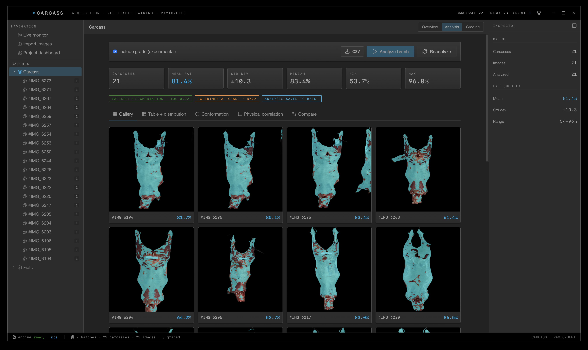
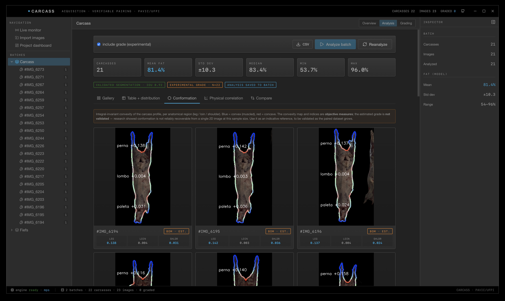
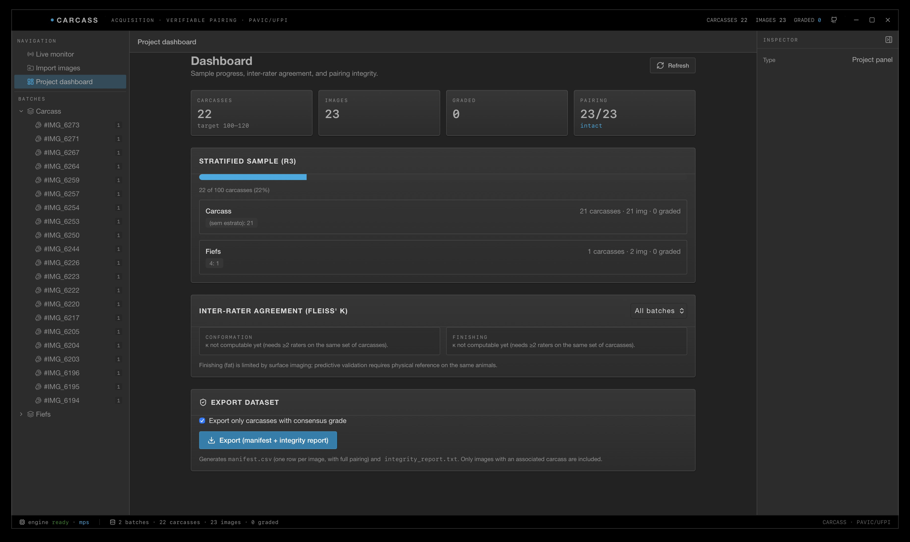
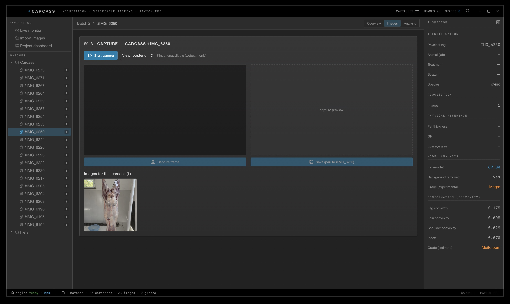

# Apex

[](https://github.com/rexionmars/apex/actions/workflows/ci.yml)
[](https://github.com/rexionmars/apex/actions/workflows/release.yml)
[](LICENSE)

**Acquisition, pairing and image analysis of ovine carcasses, with verifiable image–animal–grade association.**

Apex is a cross-platform desktop application for building a carcass image dataset
and deriving objective measurements from it. Its objective is that the association
between each **image**, the **animal** it came from, and the **grade** assigned to
it is recorded at collection time and can be verified, rather than reconstructed
from filenames afterwards.

Developed at iCEV.

---

## Background

A previous data-collection effort did not fail because of its machine-learning
methods. It failed because the image–animal–grade association was not recorded
during collection. It was reconstructed afterwards, by file order, with duplicated
and illegible physical tags and a spreadsheet that had no image-name column. In
Apex, a carcass is registered with a mandatory physical tag before capture, and
the image is stored with a reference to it in the database.

## What it does

- **Collection** — register a carcass (mandatory physical tag), then capture from
  an external camera; the image is born paired, never inferred from a filename.
- **Import** — bring in external photos; each becomes a carcass (or is reconciled
  to one), with `sha256` dedup, so nothing is orphaned.
- **Analysis** — trained models over the batch: **fat segmentation** (validated,
  IoU ~0.92), an **experimental finishing grade**, and an analytical
  **conformation convexity** measure — all with automatic background removal so
  surface measurements are correct.
- **Conformation** — integral-invariant convexity of the carcass profile
  (leg / loin / shoulder), rendered as a blue-convex / red-concave map. Analytical,
  training-free, invariant to pose and lighting.
- **Inter-rater grading** — independent, blind grades from multiple raters, with
  Fleiss' κ agreement.
- **Live monitor** — real-time fat overlay from a camera or a video file, to help
  frame the carcass (background subtraction, ~real-time).
- **Dashboard & export** — sample progress against the target, and a dataset
  export (`manifest.csv` + `integrity_report.txt`).

## Screenshots

| Analysis · Gallery | Analysis · Conformation |
|---|---|
|  |  |

| Project dashboard | Carcass · Images (capture + inspector) |
|---|---|
|  |  |

## Stack

**Wails v2 + Go** (window, database, pairing) · **React 19 + TypeScript + Tailwind 4**
(the instrument UI, styled after NASA Open MCT "Espresso") · **Python sidecars**
(PyTorch / OpenCV) for inference, live overlay and conformation · a single
**SQLite** file as the source of truth.

## Download

Pre-built native binaries for **macOS, Windows and Linux** are attached to every
[release](https://github.com/rexionmars/apex/releases), with the model weights
already bundled. Grab the archive for your platform, unpack, and run — no build
tools required (the Python analysis features still need a Python with the
scientific libraries below).

## Building from source

Prerequisites: Go 1.23+, Node 18+, the [Wails CLI](https://wails.io), and (for the
model features) a Python with `torch`, `opencv-python`, `scikit-image`, `scipy`,
`rembg`.

```bash
go install github.com/wailsapp/wails/v2/cmd/wails@latest
pip install torch opencv-python scikit-image scipy rembg onnxruntime

# development (hot reload)
wails dev

# if your system python3 lacks the libraries above:
export CARCASS_PYTHON=/path/to/python-with-torch
wails dev

# native build
wails build
```

Model weights (`fat_binary.pth`, `direct_class.pth`, `eg_regression.pth`,
`joost_color_naming.mat`) are included under [`model/weights/`](model/weights/) —
see [`model/weights/README.md`](model/weights/README.md) for what each one is.

## Documentation

A full user & reference manual (LaTeX book, with screenshots) is in
[`docs/`](docs/), in two languages:

- **English** — [`docs/manual.pdf`](docs/manual.pdf) (build: `pdflatex manual.tex`)
- **Português (BR)** — [`docs/manual-ptbr.pdf`](docs/manual-ptbr.pdf) (build: `pdflatex manual-ptbr.tex`)

## Scientific scope

Fat segmentation and verifiable pairing are validated/guaranteed. The **finishing
and conformation grades are experimental estimates, not validated** — the
project's oracle experiment showed conformation is not reliably recoverable from a
single 2D image at n=22. Apex marks these in amber throughout, and the dataset it
builds is intended to support their validation. See Station 13 of the manual.

## License

MIT — see [LICENSE](LICENSE).
